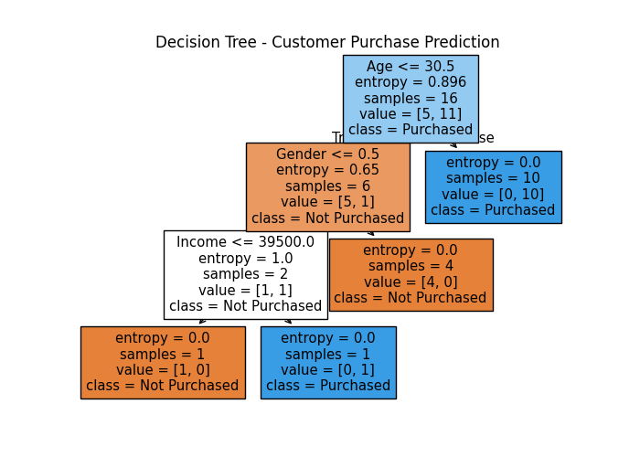

# Decision Tree Classifier – Customer Purchase Prediction

This project builds a **Decision Tree Classifier** to predict whether a customer will purchase a product or service based on demographic data like age, income, and gender. The dataset is custom-made to keep the model interpretable and easy to visualize.

---

## 📌 Task Objective

> Build a decision tree classifier to predict whether a customer will purchase a product or service based on their demographic and behavioral data.  

- **Dataset Used:** Custom dummy dataset (20 records)
- **Inspired by:** Bank Marketing Dataset
- **Format:** CSV-like dictionary converted to `DataFrame`
- **Rows:** 20  
- **Columns:** 4 (`Age`, `Income`, `Gender`, `Purchased`)

---

## 🧹 Data Preparation

- Created a small custom dataset manually using Python dictionaries
- Encoded categorical variables:
  - `Gender`: Male = 0, Female = 1  
  - `Purchased`: No = 0, Yes = 1
- Split the dataset into **training** and **testing** sets (80-20)

---

## 🌳 Model Building

- Model: `DecisionTreeClassifier` from `sklearn`
- Criterion: `entropy` (for better information gain split)
- Max Depth: 3 (to keep the tree simple and readable)
- Trained the model on the training set
- Evaluated using accuracy and classification report

---

## 📈 Tree Visualization

| Plot | Description |
|------|-------------|
| | Displays how the model makes decisions based on `Age`, `Income`, and `Gender` |

The decision tree is visualized using `matplotlib` and `sklearn.tree.plot_tree()`. 

---

## 🔧 Tools & Libraries Used

- Python
- Pandas
- Scikit-learn
- Matplotlib

---

## 🧠 Author Note

Created as a part of **Decision Tree Classifier task** for the Prodigy InfoTech Data Science Internship.
